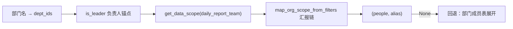

# 日报/周报 生成阶段统计口径 OAuth 接入说明（W6）

> **OAuth 真源**：aptsell-oauth `docs/data-scope-matrix.md` §2.1（日报/周报 = autoflow 定时统计 + 卡片推送）、§3.2「日报/周报」行
> **Autoflow 落点**：`CRMStatisticsService._resolve_department_owners_for_todo_stats`（团队日报「按成员任务统计」的人群展开）
> **前置**：OAuth 已部署 `daily_report_*` / `weekly_report_*` data-scope 种子（`w3_data_scope_policies`）

---

## 1. 范围与原则

| 项 | 说明 |
|----|------|
| **本期已接入** | **生成阶段**团队维度「统计人群」按 OAuth `org_scope`（汇报链）确定 |
| **实体** | `daily_report_team` / `weekly_report_team`（团队维度才需展开人群） |
| **核心原则** | 日报/周报是「定时统计 + 卡片推送」，**不是** business_native CRUD；生成任务按维度用 `org_scope` 规则确定统计人群，**不走** `crm_data_authority` |
| **锚点** | 部门负责人（`user_department_relation.is_leader=True`），非 `user_profiles` 直属上级 |

### 本期未接入 / 无需接入

| 项 | 说明 |
|----|------|
| **个人日报** | 一人一卡、只含本人数据 = 天然 `SELF_ONLY`，无需展开 |
| **公司日报** | `aggregate_company_report` 走公司级预聚合 = `GLOBAL`，不做 per-member 富集 |
| **周报（经典）** | `generate_crm_weekly_report` 内容来自外部 Aldebaran（`fetch_weekly_report`），autoflow 侧无 per-member 聚合，无可施加 `org_scope` 的口径 |
| **周跟进总结** | `crm_weekly_followup_service` 已按自身逻辑（部门子树）单独接入，**未纳入本次** |
| **历史报告列表 data-scope** | `reports.py` 未上线，本次不接 |

### 卡片接收权限（已接入）

| 维度 | 权限码 | 行为 |
|------|--------|------|
| 个人日报 | `notification:daily_report_personal:receive` | 路由=本人；推送前 `check_function_permission` |
| 团队日报 | `notification:daily_report_team:receive` | 路由=部门负责人；个人接收者过滤；**`department_review` 群推送不校验** |
| 公司日报 | `notification:daily_report_company:receive` | `get_users_by_permission` 直接作为收件人名单 |
| 部门周报 | `notification:weekly_report_team:receive` | 同团队日报：负责人过滤；**群推送不校验** |
| 公司周报 | `notification:weekly_report_company:receive` | `get_users_by_permission` 直接作为收件人名单 |

落点：`platform_notification_service`（常量见 `platforms/notification_types.py`）。

---

## 2. 接入流程

```text
① department_mirror.get_department_ids_by_name(name) → dept_ids（DepartmentMirror.unique_id）
② user_department_relation.get_department_leader(dept_ids) → 部门负责人（is_leader=True）
③ get_data_scope(user_id=负责人, crm_user_id, entity=daily_report_team) → filters
④ map_org_scope_from_filters(filters) → 团队 users.id（含负责人本人）
⑤ user_profile.get_by_user_ids → 组装 (people, alias_to_canonical)
```



任一环节缺失（无 dept_ids / 无负责人 / 无可解析 user_id / org_scope 空 / 无档案）→ 返回 `None`，调用方回退旧逻辑。

---

## 3. 配置开关

位于 `app/core/config.py`（可通过环境变量覆盖）：

| 配置项 | 默认值 | 作用 |
|--------|--------|------|
| `REPORT_OAUTH_SCOPE_ENABLED` | `True` | 团队日报/周报统计人群按 OAuth `org_scope` 展开；关闭时回退按部门成员表展开 |

**行为：**

| 开关 | 行为 |
|------|------|
| `True`（默认） | 团队人群 = 负责人汇报链（OAuth）；解析失败/为空自动回退 |
| `False` | 全部走遗留部门成员展开（`department_mirror` + `UserDepartmentRelation` + `UserProfile` + 当日 sales 记录） |

回滚示例：

```bash
REPORT_OAUTH_SCOPE_ENABLED=false
```

---

## 4. 代码结构

```text
backend/app/
  permissions/
    report_scope_service.py       # 核心：部门负责人锚点 → org_scope → 团队人群
    user_id_resolver.py           # map_org_scope_from_filters / map_crm_user_ids_to_user_ids（复用）
  services/
    oauth_service.py              # get_data_scope / get_subordinate_chain HTTP 客户端（复用）
    crm_statistics_service.py     # _resolve_department_owners_for_todo_stats 注入 OAuth 优先分支
  repositories/
    user_department_relation.py   # 新增 get_department_leader（is_leader 负责人）
    department_mirror.py          # get_department_ids_by_name（复用）
    user_profile.py               # get_by_user_ids（复用）

backend/tests/
  test_report_scope_service.py    # 9 例：负责人解析/回补、org_scope 展开、回退分支
```

---

## 5. `ReportScopeService.resolve_team_owners`

`app/permissions/report_scope_service.py`：

| 入参 | 说明 |
|------|------|
| `session` | DB 会话 |
| `department_name` | 部门名（团队日报/周报按部门名一张卡） |
| `entity` | 默认 `daily_report_team`；周报传 `weekly_report_team` |

**返回**：`(people, alias_to_canonical)` 或 `None`（回退信号）

| 结构 | 内容 |
|------|------|
| `people` | `canonical(users.id) → 显示名` |
| `alias_to_canonical` | `users.id → canonical` 且 `crm_user_id → canonical`（覆盖 `crm_todos.owner_id` 可能存 crm_user_id 的情况） |

> `canonical` 取 `users.id` 字符串，与个人日报 `recorder_id` / `crm_todos` owner 对齐，可直接替换
> `_resolve_department_owners_for_todo_stats` 的返回。

### 负责人锚点解析（关键）

1. `dept_ids = department_mirror.get_department_ids_by_name(name)` —— 与遗留展开同一 id 空间（`unique_id`）。
2. `leader = user_department_relation.get_department_leader(dept_ids)` —— `is_leader=True AND is_active`，`ORDER BY is_primary DESC, id` 稳定 tie-break。
3. `leader.user_id` 为空但有 `crm_user_id` → 用 `map_crm_user_ids_to_user_ids` 经 `user_profiles` **回补** `users.id`。
4. 仍无 / 非法 UUID → 回退。

三种回退日志各自独立，便于排查：

| 日志 | 含义 |
|------|------|
| `no leader for department=...` | 该部门无 `is_leader` 记录 |
| `leader has no resolvable user_id (crm_user_id=...)` | 有负责人但 user_id 缺失且回补失败 |
| `invalid leader user_id=...` | user_id 非法 UUID |
| `leader user_id backfilled from user_profiles (crm_user_id=...)` | 回补成功 |
| `empty org_scope for department=... entity=...` | 负责人无 `org_scope`（非团队角色）→ 回退 |
| `department=... entity=... members=N (OAuth org_scope)` | 命中，团队 N 人 |

---

## 6. 生成侧注入点

`app/services/crm_statistics_service.py`：

`_resolve_department_owners_for_todo_stats` 用 OAuth 结果作**基础人群**，再统一并入当日拜访记录人（开关门控 + `try/except` 兜底）：

```text
# 1) 基础人群：OAuth 命中则用 org_scope，否则回退部门成员表展开
oauth_owners = None
if REPORT_OAUTH_SCOPE_ENABLED:
    oauth_owners = report_scope_service.resolve_team_owners(session, name)   # 异常→None

if oauth_owners is not None:
    people, alias = oauth_owners
else:
    people, alias = department_mirror + UserDepartmentRelation + UserProfile 展开

# 2) 兜底并入：统计日 sales_stats 中归属本部门、基础名册未覆盖的 recorder
#    （按 canonical 去重，重复并入不重复计数）
```

> **为何 OAuth 命中后仍并入当日 recorder**（非冗余）：
> - OAuth 基础名册来自「负责人 OAuth 汇报链」，与 `user_department_relation` 主部门是两套来源——汇报链外但主部门归本部门的人只能在此补入；
> - `sales_stats` 用主部门且不过滤 `is_active`/`crm_user_id`，而回退名册的 relation 查询要求 `is_active=True` 且 `crm_user_id` 非空——主部门行停用/缺 crm_id 的 recorder 仅在此补入。
>
> 即：开启 OAuth 时，团队统计人群 = **负责人汇报链 ∪ 当日本部门拜访记录人**（部门日报口径，保证「有拜访不漏统计」）。

调用链：

```text
aggregate_department_reports (团队日报)
  └ _enrich_department_report_with_todo_stats
      └ get_department_daily_todo_task_stats
          └ _resolve_department_owners_for_todo_stats  ← 本次注入
```

> 团队日报里**非**按成员枚举的部分（`crm_department_daily_summary` 预聚合的红黄绿灯等）在别处按部门预聚合，本次不涉及；真正随 `org_scope` 变化的是「按成员任务统计（`tasks_by_owner`）」。

---

## 7. 部门负责人锚点：为何弃用 `user_profiles`

| 维度 | 旧：`user_profiles.direct_manager_id IS NULL` | 新：`user_department_relation.is_leader=True` |
|------|------|------|
| 语义 | 「无直属上级」= 组织根（CEO），非部门负责人；负责人若向更高层汇报会被漏 | 源系统权威「部门负责人」标记 |
| 匹配键 | 按 `department` 名（冗余字段），跨树同名部门无法区分 | 按 `department_id`（`unique_id`），与遗留展开同一 id 空间 |
| 确定性 | `.first()` 无排序 | `is_primary DESC, id` 稳定 |

`get_department_leader`（`app/repositories/user_department_relation.py`）：`department_id IN dept_ids AND is_leader AND is_active`，`ORDER BY is_primary DESC, id` 取一条。

---

## 8. 数据约定

| 字段 | 约定 |
|------|------|
| `user_department_relation.department_id` | `DepartmentMirror.unique_id`（与 `get_department_ids_by_name` 结果同空间） |
| `user_department_relation.user_id` | 外部系统 `users.id`（UUID 字符串，可空 → 回补） |
| `crm_todos.owner_id` | 可能存 `users.id` 或 `crm_user_id`，故 `alias_to_canonical` 同时登记两者 |
| `org_scope` 映射 | `crm_user_ids → users.id`；`team_subordinates` 再调 `POST /permission/subordinate-chain/query` 展开下属（复用 follow_up 机制，缓存 60s） |

---

## 9. 验收用例（最小集）

| # | 场景 | 期望 |
|---|------|------|
| 1 | 部门有 `is_leader` 负责人，负责人为 SALES_MANAGER | 团队日报按成员统计 = 负责人 + 汇报链下属 |
| 2 | 负责人仅有 `crm_user_id`（无 user_id）但 `user_profiles` 可映射 | 回补成功，正常展开 |
| 3 | 部门无 `is_leader` 记录 | 回退部门成员表展开 |
| 4 | 负责人非团队角色（`org_scope` 空） | 回退 |
| 5 | `REPORT_OAUTH_SCOPE_ENABLED=false` | 全部走遗留展开 |
| 6 | OAuth 不可达 | `try/except` 兜底回退，报告仍产出 |

---

## 10. 本地测试

```bash
cd backend
python -m pytest tests/test_report_scope_service.py -q
python -m pytest tests/test_report_receive_permission_gate.py -q
```

> 说明：沙箱环境跑完整 app 的 pytest 可能因原生依赖 segfault，需在沙箱外运行。
> receive gate 覆盖：个人/团队过滤、公司 `by-permission` 权限码、日/周报发送路径绑定。

---

## 11. 后续扩展

| 项 | 说明 |
|----|------|
| **周报统计口径** | 若将来 autoflow 侧对周报做 per-member 聚合，可直接 `resolve_team_owners(..., entity="weekly_report_team")` |
| **历史报告列表 data-scope** | `reports.py` 上线后按 §2.1 note 3 对 `daily_report_*`/`weekly_report_*` 走 data-scope 过滤 |
| **负责人缺 user_id 兜底增强** | 当前回补失败即回退；可评估以 `crm_user_id` 直接作 `org_scope` 锚点 |

---

## 12. 相关文档索引

| 文档 | 内容 |
|------|------|
| aptsell-oauth `docs/data-scope-matrix.md` §2.1 | 日报/周报两层权限（统计口径 + 卡片订阅）定义 |
| aptsell-oauth `docs/data-scope-matrix.md` §3.2 | 各角色日报/周报可见范围 |
| aptsell-oauth `alembic/seed_data/w3_data_scope_policies.py` | `daily_report_*` / `weekly_report_*` scope 种子 |
| `backend/docs/follow-up-oauth-permission.md` | 跟进 / 周跟进 / 周经营决策 OAuth 接入 |
| `backend/tests/test_report_receive_permission_gate.py` | 日/周报卡片 receive gate 单测 |
