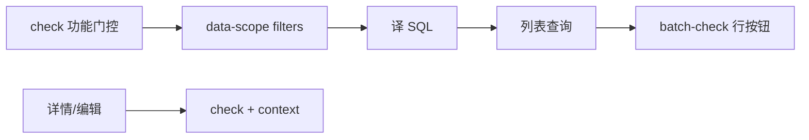

# 跟进记录 OAuth 权限接入说明（W4 P1.1）

> **OAuth 真源**：[aptsell-oauth `autoflow-follow-up-integration.md`](https://github.com/aptsell/aptsell-oauth/blob/main/docs/autoflow-follow-up-integration.md)  
> **Autoflow 实体**：`crm_sales_visit_records`（`CRMSalesVisitRecord`）↔ OAuth `entity=follow_up`  
> **前置**：OAuth 已部署 migration `018+`（`follow_up` 实体种子、`LINKED_CRM` 默认关）

---

## 1. 范围与原则

| 项 | 说明 |
|----|------|
| **本期已接入** | 跟进列表/详情/编辑/导出/评论读取；行内编辑/删除按钮权限 |
| **权限码** | `sales:follow_up:view` / `edit` / `delete` / `export` |
| **核心原则** | 跟进是 **business_native**：列表用 **data-scope → SQL**，单条操作用 **check + context** |
| **禁止** | 列表逐条 `check`；用 `crm_data_authority` JOIN 跟进表替代 data-scope |

### 本期未接入

| 项 | 说明 |
|----|------|
| `weekly_followup` | 周跟进列表/详情已接 OAuth（见下节 Wave A2）；生成任务仍按部门子树 |
| `notification:follow_up_card:receive` | 跟进/拜访卡片 **receive 资格 gate**（Wave A：**命名已对齐，推送不校验**；抄送走 `notification_cc_rules`） |
| `crm:*:log_follow_up` | CRM 详情「录入跟进」，仍走 CRM mirror |
| OAuth **collaborator** filter | 需 `follow_up_collab` 表；`collaborative_participants` 是 CC/通知语义，**不等同** OAuth 协作者 |
| **LINKED_CRM** 列表分支 | OAuth 默认关（D8）；translator 已预留，未拼 SQL |

---

## 2. 五步接入流程

```text
① POST /permission/check   permission=sales:follow_up:view（无 resource）→ 功能门控
② POST /permission/data-scope entity=follow_up（可缓存 60s）→ filters
③ 业务 translate filters → perm WHERE
④ SELECT ... WHERE perm_clause AND <业务筛选>
⑤ POST /permission/batch-check  当前页行内按钮（带 resource + context）
```



---

## 3. 配置开关（Wave A3）

跟进列表/详情/导出 **固定走 OAuth**，不再提供 `FOLLOW_UP_OAUTH_GATE_ENABLED` /
`FOLLOW_UP_OAUTH_DATA_SCOPE_ENABLED` 回退开关；遗留 `VisitRecordAccessPolicy` /
`report51:*` 路径已删除。

回滚若需降级，只能通过 OAuth 侧权限配置或回退部署版本，不能靠本地开关切回旧汇报链过滤。

---

## 4. 代码结构

```text
backend/app/
  permissions/
    follow_up_permission_service.py   # 编排：gate / data-scope / check / batch-check
    follow_up_scope_translator.py   # data-scope filters → SQL WHERE（源自 aptsell-oauth 示例）
    follow_up_context_builder.py    # 单条 check 的 context 组装
    user_id_resolver.py             # org_scope.crmUserIds → users.id
  services/
    oauth_service.py                # check / data-scope / batch-check HTTP 客户端
  repositories/
    visit_record.py                 # 列表 perm 注入、单条权限、行内 permissions
  api/routes/crm/visit_records/
    router.py                       # 门控、列表响应

backend/tests/
  test_follow_up_scope_translator.py
  test_follow_up_permission_service.py
  test_follow_up_list_permission.py
  test_follow_up_context_builder.py
  test_follow_up_record_check.py
  test_follow_up_batch_check.py
```

---

## 5. OAuth 客户端

`OAuthClient`（`app/services/oauth_service.py`）新增/扩展：

| 方法 | 接口 | 缓存 |
|------|------|------|
| `check_permission` | `POST /permission/check` | 无（带 context 不缓存） |
| `get_data_scope` | `POST /permission/data-scope` | 60s（按 `user_id:entity`） |
| `get_subordinate_chain` | `POST /permission/subordinate-chain/query` | 60s（按 `user_id`） |
| `batch_check_permissions` | `POST /permission/batch-check` | 无 |

请求体使用 snake_case（与 OAuth schema 一致），需同时传：

- `user_id`：`users.id`（UUID）
- `crm_user_id`：`user_profiles.crm_user_id`（有则传）

服务间调用 `/permission/*` 时需配置 `OAUTH_PERMISSION_API_TOKEN`，Autoflow 会自动附加 `Authorization: Bearer <token>` 请求头。

---

## 6. 列表 data-scope（PR2）

### 触发条件

请求带 `current_user_id` 时，列表/COUNT/导出一律注入 OAuth data-scope WHERE。

### SQL 翻译规则

| filter | 列表语义 | Autoflow SQL |
|--------|----------|--------------|
| `global` + `enabled` | 不加数据范围 | `1=1` |
| `self_creator` | 本人录入 | `recorder_id = :perm_user_id`（32 位无连字符 `users.id`） |
| `org_scope` | 主管看下级 | `recorder_id IN (:orgUserIds...)`；`mode=team_subordinates` 时经 OAuth 下属链展开锚点 `crm_user_ids` |
| `collaborator` | 协作者 | **未接入**（`collab_exists_sql=None`） |
| `linked_crm` | 关联 CRM 可见 | **未拼入**（默认 `enabled: false`） |
| 空 filters | 无数据 | `1=0` |

主表引用名为 `crm_sales_visit_records`（无需 ORM alias）。

### 关键约束

- **COUNT、列表、导出** 共用同一 `perm` 片段（`_apply_visit_record_list_permission`）
- **禁止**用 `crm_user_id` 直接匹配 `recorder_id`
- `recorder_id` 存 **`users.id`**；兼容 32/36 位 UUID

---

## 7. 功能门控（PR1）

### 拦截点

| 接口 | 权限 |
|------|------|
| `POST /crm/visit_records/query` | `sales:follow_up:view`（功能层，无 resource） |
| `POST /crm/visit_records/export` | `sales:follow_up:view` + `sales:follow_up:export` |

跟进记录属业务数据，**superuser 不绕过**门控，与普用户同样走 OAuth。

`function_allowed === false` → HTTP 403。

---

## 8. 单条 check + context（PR3）

### 触发条件

有 `current_user_id` 时一律走 OAuth `check` + context（Wave A3：无本地开关绕过）。

### 接入点

| 操作 | 方法 | permission |
|------|------|------------|
| 详情 | `get_visit_record_by_id` | `sales:follow_up:view` |
| 评论追加 | `update_visit_record_comments` | `sales:follow_up:view` |
| 修订历史 | `list_visit_record_revisions` | `sales:follow_up:view` |
| 监督修改 | `supervised_revise_visit_record` | `sales:follow_up:edit` |

`allowed === false` → 404/403（与现网一致，不暴露存在性）。

### Context 字段（`FollowUpContextBuilder`）

| 字段 | 来源 |
|------|------|
| `recorder_id` | `record.recorder_id`（`users.id` 字符串） |
| `is_collaborator` | 固定 `false`（协作者未接入） |
| `account_id` / `opportunity_id` / `partner_id` | 跟进行字段 |
| `is_manager` | OAuth 下属链非空 **或** 主管角色（`SALES_MANAGER` 等） |
| `is_subordinate_creator` | `recorder_id` 在 OAuth 下属链中 |

### resource

```json
{
  "type": "follow_up",
  "id": "<record.record_id>"
}
```

---

## 9. 列表行内按钮 batch-check（PR4）

### 触发条件

`POST /crm/visit_records/query` 且 `include_row_permissions=True` 时启用（**当前路由默认关闭**：编辑由前端按用户功能权限统一控制，尚无删除能力）。

仅对**当前页**记录发起一次 batch-check；导出分页**不**调用。

### 响应字段

每条 `VisitRecordResponse` 可含：

```json
{
  "record_id": "fu-001",
  "permissions": {
    "can_edit": true,
    "can_delete": false
  }
}
```

列表当前页有记录时返回 `permissions`（`can_edit` / `can_delete`）；无用户或空页则省略。

### batch-check 请求结构（每条记录 2 项）

```json
{
  "user_id": "...",
  "crm_user_id": "...",
  "checks": [
    {
      "permission": "sales:follow_up:edit",
      "resource": { "type": "follow_up", "id": "fu-001" },
      "context": { "recorder_id": "...", "is_collaborator": false, ... }
    },
    {
      "permission": "sales:follow_up:delete",
      "resource": { "type": "follow_up", "id": "fu-001" },
      "context": { ... }
    }
  ]
}
```

结果顺序与 `checks` 一致。

---

## 10. 与遗留权限的关系

| 遗留 | 迁移后 |
|------|--------|
| `visit_record:page:view` | OAuth alias → `sales:follow_up:view`（功能层由 OAuth 处理） |
| `visit_record:card:receive` | OAuth alias → `notification:follow_up_card:receive`；autoflow 常量 `PERM_FOLLOW_UP_CARD_RECEIVE`；**推送不 gate**（见 `visit-record-cc-rules.md`） |
| `report51:dept/company:view` 列表范围 | Wave A3：跟进列表**不再**使用；统一 OAuth data-scope |
| `report51:dept/company:view` 周跟进详情 | Wave A2：已改为 `sales:weekly_followup:view` + `sales_weekly_followup` data-scope / leader（见下） |
| `VisitRecordAccessPolicy` / `_is_admin_user` | Wave A3：**已删除**（跟进固定 OAuth） |
| `_get_user_accessible_recorder_ids` / `_get_visit_record_accessible_recorder_uuid_ids` | **已删除**（无调用方） |
| `can_access_all_crm_data`（`crm:company:query`） | **已删除**；周经营公司级范围改为 `biz_weekly_decision` data-scope `global`（S4） |
| `review_session:all:view` | Wave B1：已改为 `biz:weekly_decision:view`（见 `policies/review_session_access.py`） |

### Wave A3：删除跟进遗留 ACL

| 删除项 | 替代 |
|--------|------|
| `policies/visit_record_access.py` | `follow_up_permission_service` |
| `FOLLOW_UP_OAUTH_GATE_ENABLED` / `FOLLOW_UP_OAUTH_DATA_SCOPE_ENABLED` | 固定开启，配置项已移除 |
| `report51:company:view`（跟进 admin） | data-scope `global` + OAuth check |

### Wave A2：周跟进详情去 `report51`

| 路径 | 权限 |
|------|------|
| 列表 `/crm/weekly-followup/query` | `sales:weekly_followup:view` + data-scope `global`（company）/ 本部门（department） |
| 详情 / filter-options | 同上功能门控；`is_company_admin` ← global；`can_view_team` ← global / 非 self filter（如 `org_scope`）/ 部门 leader |
| 评论编辑 | 仍仅公司级范围或 leader（与 A2 前一致） |

落点：`permissions/weekly_followup_permission_service.py`、`api/routes/crm/weekly_followup/router.py`（`_can_view_weekly_followup`）。  
说明：`is_company_admin` **不再**看 `user.is_superuser`，仅 data-scope `global`。

### Wave B1 / S4：周经营决策权限对齐

| 路径 | 权限 |
|------|------|
| 功能门控 | `biz:weekly_decision:view`（legacy `review_session:all:view` 仅作常量别名说明） |
| 公司级列表/可见范围 | `biz_weekly_decision` data-scope **global**（已删除 `can_access_all_crm_data` / `crm:company:query`） |
| 部门范围 | 有 view + 主部门 + 非 global → 本部门及下属子树 |
| 无部门信息的 viewer | 全公司（与 B1 前一致） |

落点：`policies/review_session_access.py`、`api/routes/crm/review/router.py`。

---

## 11. 数据约定

| 字段 | 约定 |
|------|------|
| `crm_sales_visit_records.recorder_id` | **`users.id`**（UUID），非 `crmUserId` / `oauth_user_id` |
| `record_id` | OAuth resource `id` |
| `org_scope` 映射 | `crm_user_ids` → `users.id`；`team_subordinates` 再调 `POST /permission/subordinate-chain/query` 展开下属 |

历史数据若 `recorder_id` 混存其他 ID，需在接入前清洗或在 OAuth check 层出现误判。

---

## 12. 验收用例（最小集）

| # | 角色 | 操作 | 期望 |
|---|------|------|------|
| 1 | 无 `sales:follow_up:view` | 进列表 | 403 |
| 2 | SALES A | 列表 | 仅 `recorder_id=A` |
| 3 | SALES_MANAGER | 列表 | 含下级 `recorder_id` |
| 4 | BIZ_ASSISTANT | 编辑自己录入 | allow |
| 5 | 随机他人跟进 | 编辑 | deny |
| 6 | LINKED_CRM 关（默认） | 列表 | 不因关联客户多出他人跟进 |
| 7 | 列表 COUNT vs 列表 | 同条件 | 条数一致 |
| 8 | 列表当前页 | 响应 | 含 `permissions.can_edit/delete` |

---

## 13. 常见误区

| 误区 | 正确做法 |
|------|----------|
| 列表逐条 `check` | `data-scope` + 译 SQL |
| `self_creator` 用 `crmUserId` 匹配 `recorder_id` | 用 **`users.id`** |
| 用 `collaborative_participants` 实现 OAuth 协作者 | 需独立 `follow_up_collab` 表，暂未接入 |
| COUNT 与列表用不同权限条件 | 共用 `_apply_visit_record_list_permission` |
| 导出全量 batch-check | 仅列表 query 当前页 batch-check |

---

## 14. 本地测试

### 列表 `total: 0` 但 gate 未 403

常见原因：**OAuth `data-scope` 返回空 `filters`**，translator 产出 `1=0`，列表被全部过滤；而 `check`（功能门控）仍可能 `function_allowed=true`。

排查步骤：

1. 看日志是否有 `OAuth permission/data-scope returned empty filters`
2. 确认 `OAUTH_BASE_URL` 指向的 OAuth 实例已部署 follow_up data-scope（migration 018+）
3. 本地联调建议 `.env` 使用可达地址，例如 `OAUTH_BASE_URL=http://127.0.0.1:8018`（勿用仅 Docker 内可解析的 `http://auth:8018`）
4. 直连对比：
   - `POST {OAUTH_BASE_URL}/permission/data-scope`，body `{"user_id":"<users.id>","entity":"follow_up","crm_user_id":"<crm_user_id>"}`
   - 应返回含 `org_scope` / `self_creator` 等非空 `filters`
5. 确认 `user_profiles.crm_user_id` 可映射到 `users.id`，且库中 `recorder_id` 为 32 位无连字符 UUID

```bash
cd backend
python -m pytest \
  tests/test_follow_up_scope_translator.py \
  tests/test_follow_up_permission_service.py \
  tests/test_follow_up_list_permission.py \
  tests/test_follow_up_context_builder.py \
  tests/test_follow_up_record_check.py \
  tests/test_follow_up_batch_check.py \
  tests/test_oauth_service.py \
  -q
```

---

## 15. 性能说明

单次 `POST /crm/visit_records/query` 在 `include_row_permissions=true` 时的典型 OAuth 开销（**当前默认 false，列表不触发 batch-check**）：

| 阶段 | 接口 | 说明 |
|------|------|------|
| 列表 data-scope | `data-scope` + `subordinate-chain` | `team_subordinates` 需展开下属；`data-scope` / `subordinate-chain` 各缓存 60s |
| 行内按钮 | `batch-check` | 当前页每条记录 2 次 check（edit + delete），**无缓存**，通常是主要耗时 |

日志里若见 **两次** `subordinate-chain`：分别来自列表 `org_scope` 展开与 batch-check 的 `FollowUpContextBuilder`；加缓存后同用户 60s 内第二次命中本地缓存。

若列表首屏不需 `permissions.can_edit/delete`，可将 `include_row_permissions` 设为 `false` 或拆成独立接口按需加载，以去掉 batch-check 的 ~数秒开销。

---

## 16. 后续扩展

| 项 | 说明 |
|----|------|
| **协作者** | 建 `follow_up_collab(follow_up_id, user_id)`，列表传 `collab_exists_sql`，context 设 `is_collaborator` |
| **LINKED_CRM** | 租户开启后对 `crm_account`/`crm_opportunity` 各调 data-scope，用 `linked_crm_follow_up_sql` 拼 OR 分支 |
| **私密评论** | `resource.type=follow_up_comment` + `is_private`/`creator`；当前 comments 无 `is_private` 字段 |
| **跟进卡片 receive gate** | 码已对齐 `notification:follow_up_card:receive`；推送资格过滤仍关闭（抄送走 `notification_cc_rules`） |

---

## 17. 相关文档索引

| 文档 | 内容 |
|------|------|
| aptsell-oauth `docs/autoflow-follow-up-integration.md` | 方案真源、排期、验收 |
| aptsell-oauth `docs/api-permission-data-scope.md` § W4 P1.1 | 接口契约、filter 语义 |
| aptsell-oauth `docs/data-scope-matrix.md` §3.2 | 各角色可见范围 |
| aptsell-oauth `examples/follow_up_translate_scope_to_sql.py` | SQL 翻译参考实现 |
| `backend/docs/visit-record-cc-rules.md` | 拜访抄送路由（`notification_cc_rules`）；卡片码 `notification:follow_up_card:receive` 命名对齐、gate 关闭 |
| `backend/docs/daily-weekly-report-oauth-scope.md` | 日/周报统计口径 + 卡片 receive |
| `backend/tests/test_review_session_access.py` | 周经营决策 view + data-scope global |
| `backend/tests/test_report_receive_permission_gate.py` | 日/周报 receive gate |
